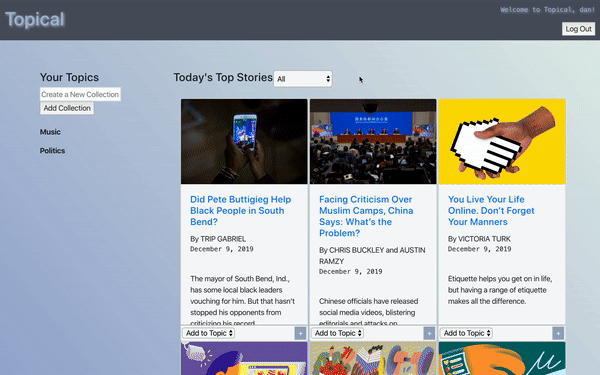

App for scanning the New York Times and creating collections of articles based on specific 
topics of interest (beta). It is a project application done for module 4 of Flatiron School. 
This project has several unfinsihed features and bugs that will be worked out in the future.
These include to-dos like: 
  - repair functionality of React Router
  - add custom validation error messages
  - enhance styling

## Authors
  - Lisa LaRochelle [lilaro](https://github.com/lilaro)
  - Dan Romans [dangrammer](https://github.com/dangrammer)

## Frontend Repository
  - [Topical Client](https://github.com/dangrammer/topical-frontend)

## Ruby Version
  - ruby 2.6.1

## Rails Version
  - rails ~> 6.0.0

## Database
  - postgreSQL

## Gem Dependencies
  - active_model_serializers ~> 0.10.0
  - rest-client ~> 2.1.0
  - rack-cors
  - bcrypt ~> 3.1.7
  - jwt ~> 2.2, >= 2.2.1
  - dotenv-rails

## Live Demo
  Link to walkthrough video with narration:
  <br/>
  <a href="https://www.youtube.com/watch?v=A3ZJxHjNVtE&feature=youtu.be" target="_blank">
    
  </a>  

## Screenshots

  Login/Signup
  <br/>
  

  Filter Articles
  <br/>
  

  Add, Edit, and Delete Collection
  <br/>
  

  Add and Edit Articles and Notes
  <br/>
  


## How To Install and Run

  1. fork (optional) then clone or download this repository to local machine
  2. use text editor and/or terminal to navigate into `topical-backend` directory
  3. run `bundle install` (or `bundle i`) in terminal to install necessary dependencies
  4. run `rails db:create` in terminal to create database
  5. run `rails db:migrate` in terminal to initialize database
  6. create secret keys:
      - create a `.env` file in root directory
      - write secret keys for JWT and NYT API in `.env` file:
        ```
        JWT_SECRET_KEY=KEY_HERE
        NYT_API_KEY=KEY_HERE
        # see note below
        ```
  7. run `rails db:seed` in terminal to seed database with article data
  8. run `rails s` in terminal to run server in browser at http://localhost:3000/
  9. install and run [Topical frontend](https://github.com/dangrammer/topical-frontend)

  *_Note:_ `KEY_HERE` _should be characters of your choice for_ `JWT_SECRET_KEY` _and an
  individually assigned key from the New York Times developer portal for_ `NYT_API_KEY` _.
  An API key for the NYT website can be attained by signing up with the_ [NYT Developer Network](https://developer.nytimes.com/)_. It is simple and free to do so._